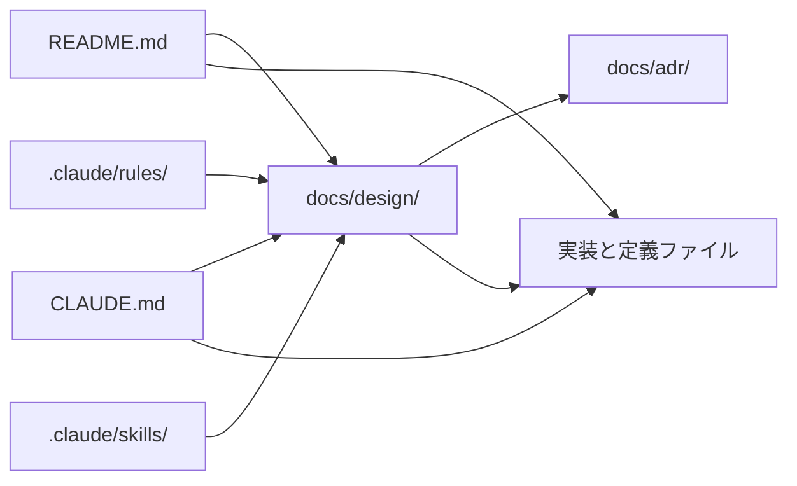

# 文書の配置

## 層と役割

- README.md: 人間の入口。目的、ディレクトリの地図、代表的なコマンド。
  値、手順、エージェント向けの指示は置かない
- ルート CLAUDE.md: エージェント向けのルーティングと、環境固有で推論できない落とし穴。
  ファイルを読めば分かることは書かない
- ディレクトリ直下の CLAUDE.md: そのディレクトリのファイルを触るときだけ必要な規約。
  起動時には読まれず、そのディレクトリのファイルを読んだときに読み込まれる
- ディレクトリ直下の README.md: その構成物を人間が操作する手順。セットアップ、
  実行例、エラーパターン、ロールバック
- docs/design/: 意図、不変条件、境界、契約、理由。1 ファイル 1 ドメイン。
  値、手順、コード例は置かない
- docs/adr/: 決定と却下案。書く、更新するときは [adr.md](adr.md) を読む
- docs/reports/: 調査メモ、計画など作業途中の成果物。ファイル名に日付と主題を含める
  (`YYYY-MM-DD-{topic}.md`)
- docs/tmp/: 使い捨てのスクリプトと出力。コミットしない
- .claude/rules/: ファイル拡張子やファイル名 prefix のように、ディレクトリ単位で
  表せないスコープ条件が要るルールだけ。paths frontmatter を必ず付ける。
  paths の無いファイルは起動時に無条件でロードされる
- .claude/skills/: 3 ステップ以上の手順。SKILL.md は概要と目次にし、詳細は
  references/ へ 1 段だけ下げる。SKILL.md は 500 行以下
- コードと設定: 値そのもの。コメントにはその値である理由だけを書く
- コミットメッセージと PR: 変更履歴、移行の経緯、issue 番号への参照

## 正本

- 値、名前、パス、書式は、機械可読な正本を実装側に 1 つ置く。lint のルール、
  script の定数、CI の workflow がこれにあたる
- コードの定数で自然に表せない語彙は、実装側に定義ファイルを置いて lint に読ませ、
  正本にする
- 文書は正本を持たず、正本の場所へリンクする
- 同じ値を 2 か所に書かない

## 参照の向き

逆向きのリンクは張らない。README.md とルート CLAUDE.md の相互リンクも張らない。

## 実装への参照

- コードを参考例として引用せず、実装へリンクする
- docs/design/ から実装へのリンクは、正本の所在を示すためだけに使う
