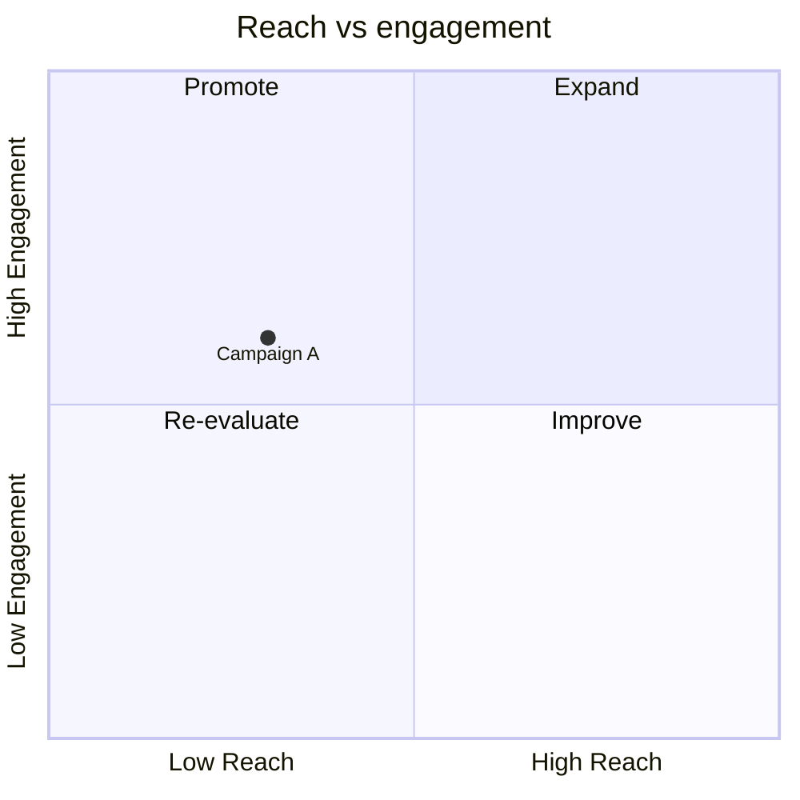
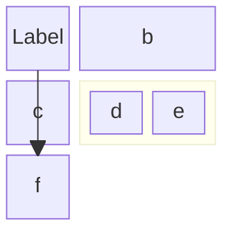
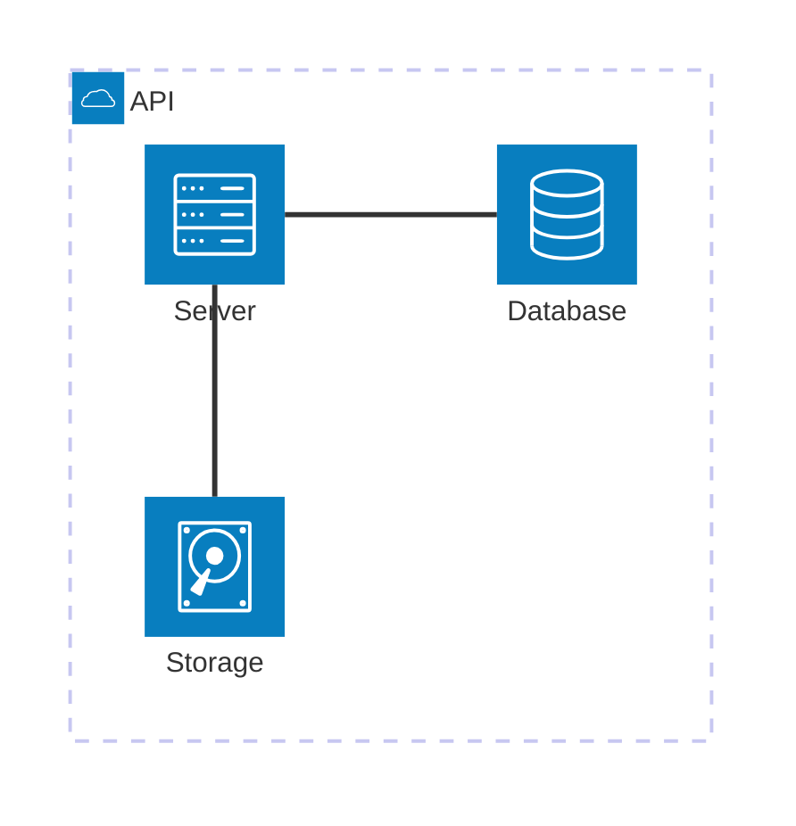
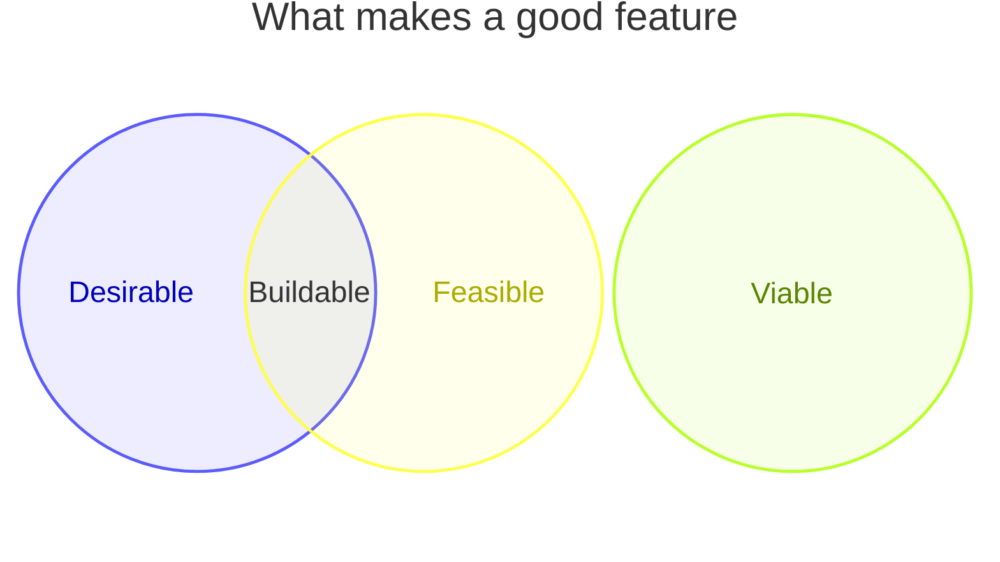
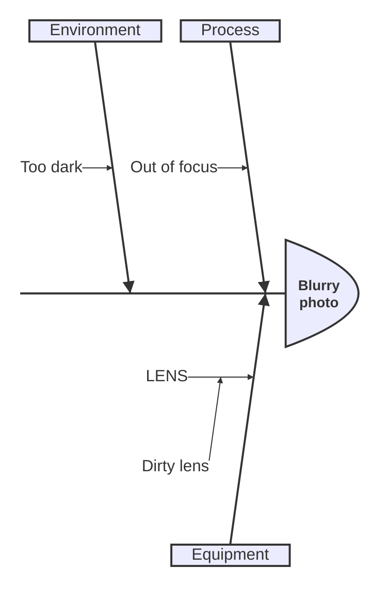
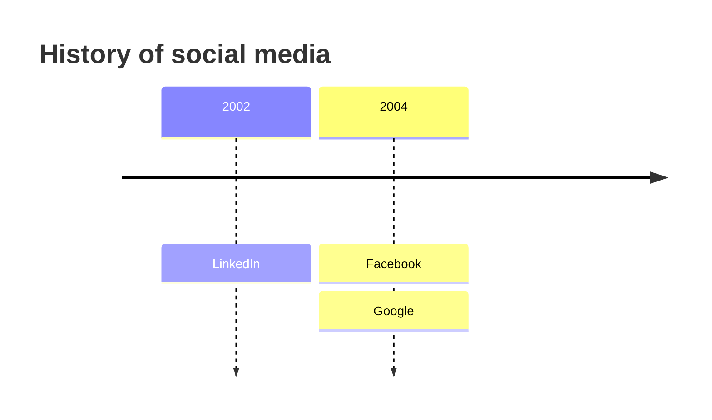
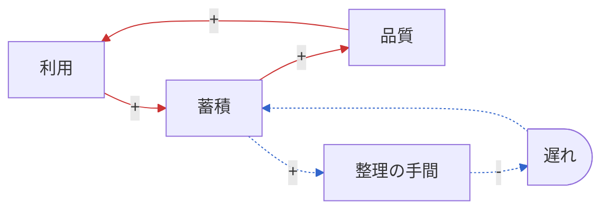

# Mermaid のパターン

書き方が自明でない図種の最小テンプレート。開始キーワードはそのまま写す。
素の `flowchart`、`sequenceDiagram`、`stateDiagram-v2` はここには載せていない。
`flowchart` は因果のループを描くときの約束事だけを載せる。

## quadrantChart

軸ラベルと 4 象限の名前は自由に付けられる。点は `ラベル: [x, y]` で、座標は
どちらも 0 から 1 の間に取る。`-beta` は付かない。

## block

積層や盤面のように、配置と幅が意味を持つ図。`columns N` で横幅を決め、`id:N` でそのブロックを N 列ぶん広げ、
`block:id:N ... end` でセルの中に入れ子の格子を作る。キーワードは `block` で、
`block-beta` は同じ図の古い綴り。

## architecture-beta

構成要素とそのグループ分け。`group id(アイコン)[ラベル]` と
`service id(アイコン)[ラベル] in グループ` で宣言し、辺は `db:L -- R:server` のように
線が出る辺と入る辺を `L`、`R`、`T`、`B` で指定する。アイコンは組み込みの `cloud`、
`database`、`disk`、`internet`、`server` だけにする。それ以外を書くと描画側で
アイコンパックの登録が必要になり、GitHub などでは出ない。`-beta` は必須。
AWS の構成図は aws-mermaid スキルに従う。

## venn-beta

`set` が集合を 1 つ宣言し、`union` が先に `set` で宣言した 2 つ以上の集合の
重なりを宣言する。`-beta` は必須。

## ishikawa-beta

最初の行が問題で、続く行がその原因になり、インデントで魚の骨の構造を作る。
`-beta` は必須。

## timeline

`期間 : 出来事` と書き、`:` で始まる行を続けると同じ期間に出来事を足せる。
`-beta` は付かない。

## 因果のループ（flowchart）

専用の図種はないので `flowchart` に約束事を載せる。符号は辺ラベルの `+` と `-`。
強化ループは実線、平衡ループは破線 `-.->` にし、`linkStyle` で輪ごとに色を付ける。
遅れは `@{ shape: delay }` のノードを辺の途中に挟み、符号はそのノードに入る側の辺に書く。
`linkStyle` の番号は辺を宣言した順に 0 から数える。遅れのノードを挟むと辺が 1 本増え、
後ろの番号がずれるので、番号は図を書き終えてから振る。
複数の輪が同じ辺を通るときは、その辺に色を付けず既定のままにする。
輪の名前と、どの要素を通るかは図の後の補足に書く。

