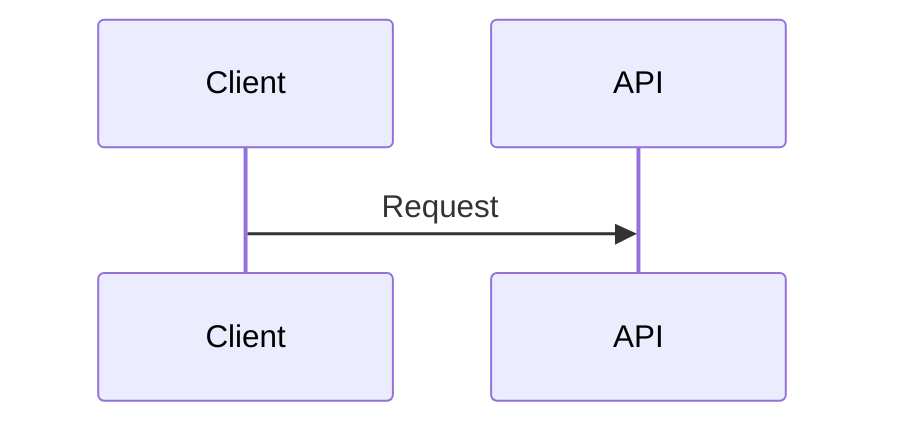

# Design: [Short Name]

## CONTEXT

- Scope: [Feature Name / Domain]
- Goal: [Primary Objective]
- Status: Draft

## DATA_MODEL (TypeScript)

```typescript
interface Entity {
  id: string;
  status: "active";
}
```

## LOGIC_FLOW (Mermaid)



## INTERFACE_CONTRACT

- Endpoint: [Method] [Path]
  - Input: { field: type }
  - Output: { result: type }
